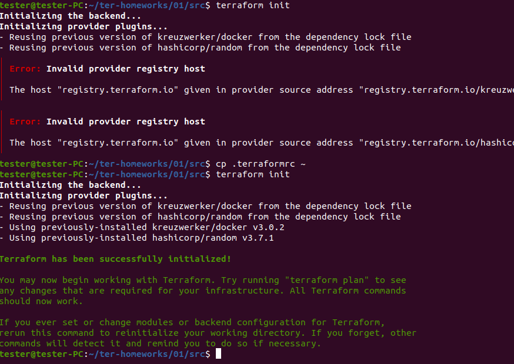
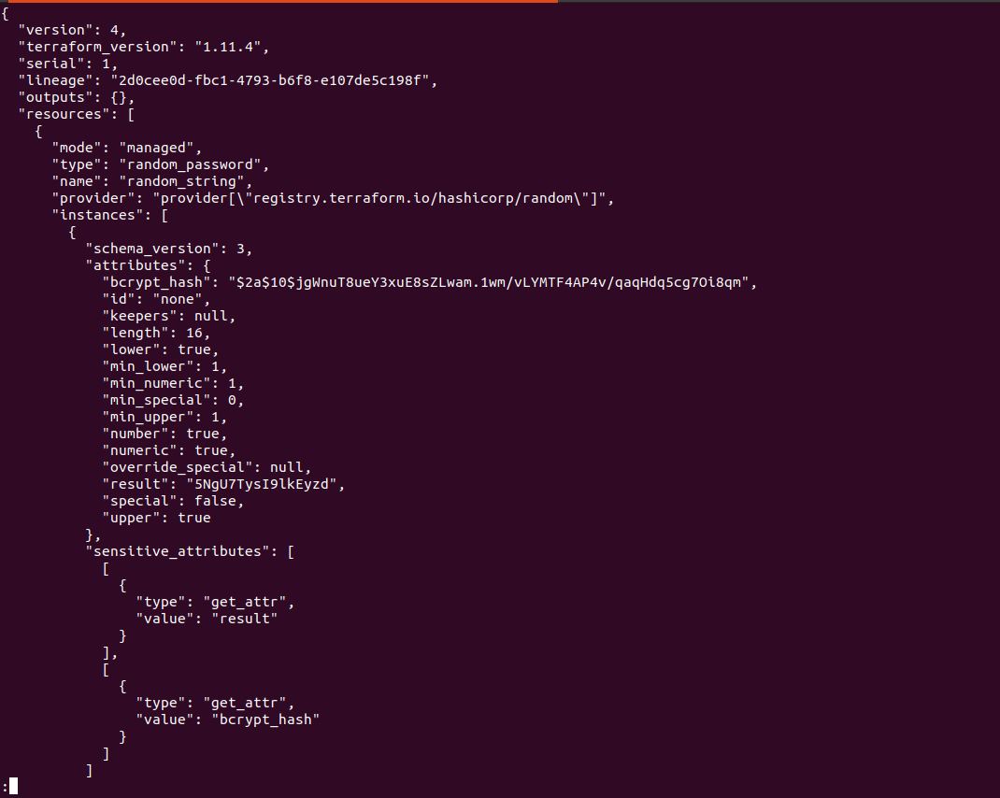
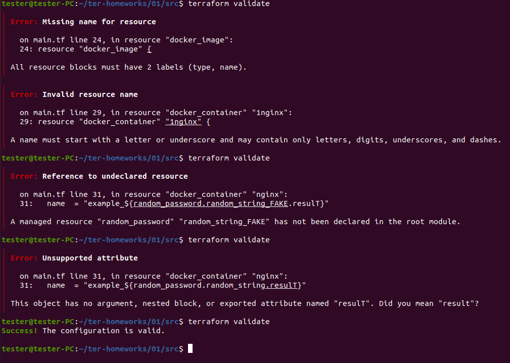
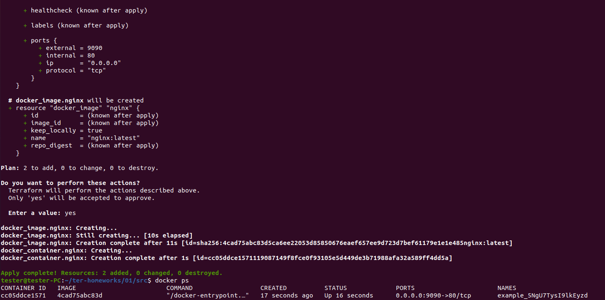
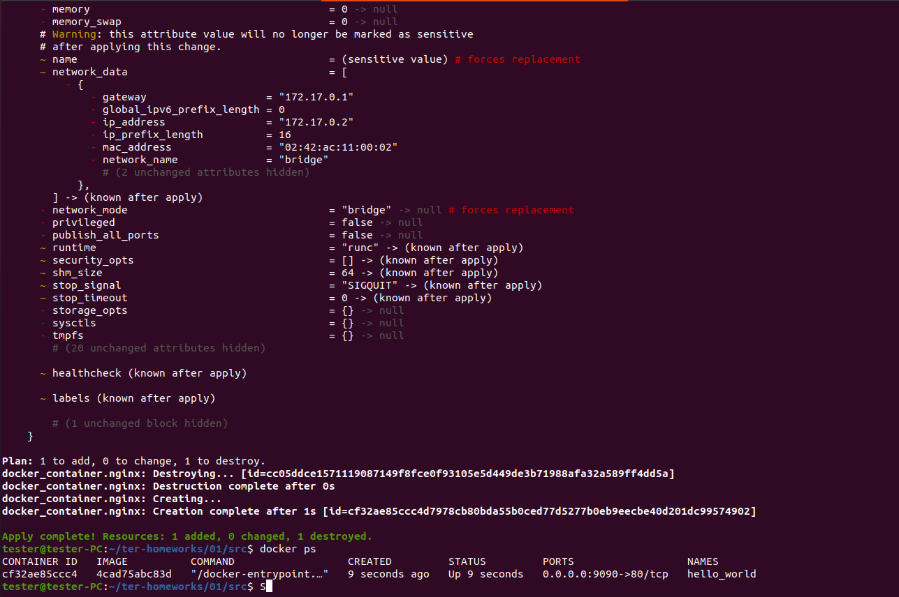

# Домашнее задание к занятию «Введение в Terraform»

https://github.com/netology-code/ter-homeworks/blob/main/01/hw-01.md

### Цели задания

1. Установить и настроить Terrafrom.
2. Научиться использовать готовый код.

------

### Чек-лист готовности к домашнему заданию

1. Скачайте и установите **Terraform** версии >=1.8.4 . Приложите скриншот вывода команды ```terraform --version```.
2. Скачайте на свой ПК этот git-репозиторий. Исходный код для выполнения задания расположен в директории **01/src**.
3. Убедитесь, что в вашей ОС установлен docker.

------

### Инструменты и дополнительные материалы, которые пригодятся для выполнения задания

1. Репозиторий с ссылкой на зеркало для установки и настройки Terraform: [ссылка](https://github.com/netology-code/devops-materials).
2. Установка docker: [ссылка](https://docs.docker.com/engine/install/ubuntu/). 

### Задание 1

1. Перейдите в каталог [**src**](https://github.com/netology-code/ter-homeworks/tree/main/01/src). Скачайте все необходимые зависимости, использованные в проекте. 
2. Изучите файл **.gitignore**. В каком terraform-файле, согласно этому .gitignore, допустимо сохранить личную, секретную информацию?(логины,пароли,ключи,токены итд)
3. Выполните код проекта. Найдите  в state-файле секретное содержимое созданного ресурса **random_password**, пришлите в качестве ответа конкретный ключ и его значение.
4. Раскомментируйте блок кода, примерно расположенный на строчках 29–42 файла **main.tf**.
Выполните команду ```terraform validate```. Объясните, в чём заключаются намеренно допущенные ошибки. Исправьте их.
5. Выполните код. В качестве ответа приложите: исправленный фрагмент кода и вывод команды ```docker ps```.
6. Замените имя docker-контейнера в блоке кода на ```hello_world```. Не перепутайте имя контейнера и имя образа. Мы всё ещё продолжаем использовать name = "nginx:latest". Выполните команду ```terraform apply -auto-approve```.
Объясните своими словами, в чём может быть опасность применения ключа  ```-auto-approve```. Догадайтесь или нагуглите зачем может пригодиться данный ключ? В качестве ответа дополнительно приложите вывод команды ```docker ps```.
8. Уничтожьте созданные ресурсы с помощью **terraform**. Убедитесь, что все ресурсы удалены. Приложите содержимое файла **terraform.tfstate**. 
9. Объясните, почему при этом не был удалён docker-образ **nginx:latest**. Ответ **ОБЯЗАТЕЛЬНО НАЙДИТЕ В ПРЕДОСТАВЛЕННОМ КОДЕ**, а затем **ОБЯЗАТЕЛЬНО ПОДКРЕПИТЕ** строчкой из документации [**terraform провайдера docker**](https://docs.comcloud.xyz/providers/kreuzwerker/docker/latest/docs).  (ищите в классификаторе resource docker_image )


## Решение 1

1. Вижу в main.tf
    ```
    required_providers {
        docker = {
        source  = "kreuzwerker/docker"
        version = "~> 3.0.1"
        }
    }
    ```
    Копирую `.terraformrc` в домашнюю дирректорию для использования зеркала

    С помощью `terraform init` загружаю зависимости
    

2. Файл `.gitignore` предлагает хранить секреты в `personal.auto.tfvars`

3. Выполняем код проекта через `terraform aply`
    

4. Допущенные ошибки объясняются комментариями под ними
    

5. Выполняем исправленный код через `terraform apply`
    ```
    terraform {
    required_providers {
        docker = {
        source  = "kreuzwerker/docker"
        version = "~> 3.0.1"
        }
    }
    required_version = ">=1.8.4" /*Многострочный комментарий.
    Требуемая версия terraform */
    }
    provider "docker" {}

    #однострочный комментарий

    resource "random_password" "random_string" {
    length      = 16
    special     = false
    min_upper   = 1
    min_lower   = 1
    min_numeric = 1
    }


    resource "docker_image" "nginx" {
    name         = "nginx:latest"
    keep_locally = true
    }

    resource "docker_container" "nginx" {
    image = docker_image.nginx.image_id
    name  = "example_${random_password.random_string.result}"

    ports {
        internal = 80
        external = 9090
    }
    }
    ```
    

6. Заменили имя и перезапустили через `terraform apply -auto-approve` - без подтверждения внесли изменения, опасно из-за возможностей потери данных из-за недосмотра при интерактивном подтверждении


7. Уничтожаем ресурсы через `terraform destroy`. Файл `terraform.tfstate`
    ```
    {
    "version": 4,
    "terraform_version": "1.11.4",
    "serial": 11,
    "lineage": "2d0cee0d-fbc1-4793-b6f8-e107de5c198f",
    "outputs": {},
    "resources": [],
    "check_results": null
    }
    ```

8. Образ nginx:latest действительно не удалился из-за `keep_locally = true` https://docs.comcloud.xyz/providers/kreuzwerker/docker/latest/docs/resources/image#keep_locally-1. И это хорошо, ведь кто-то другой тоже может использовать данный образ

------

## Дополнительное задание (со звёздочкой*)

**Настоятельно рекомендуем выполнять все задания со звёздочкой.** Они помогут глубже разобраться в материале.   
Задания со звёздочкой дополнительные, не обязательные к выполнению и никак не повлияют на получение вами зачёта по этому домашнему заданию. 

### Задание 2*

1. Создайте в облаке ВМ. Сделайте это через web-консоль, чтобы не слить по незнанию токен от облака в github(это тема следующей лекции). Если хотите - попробуйте сделать это через terraform, прочитав документацию yandex cloud. Используйте файл ```personal.auto.tfvars``` и гитигнор или иной, безопасный способ передачи токена!
2. Подключитесь к ВМ по ssh и установите стек docker.
3. Найдите в документации docker provider способ настроить подключение terraform на вашей рабочей станции к remote docker context вашей ВМ через ssh.
4. Используя terraform и  remote docker context, скачайте и запустите на вашей ВМ контейнер ```mysql:8``` на порту ```127.0.0.1:3306```, передайте ENV-переменные. Сгенерируйте разные пароли через random_password и передайте их в контейнер, используя интерполяцию из примера с nginx.(```name  = "example_${random_password.random_string.result}"```  , двойные кавычки и фигурные скобки обязательны!) 
```
    environment:
      - "MYSQL_ROOT_PASSWORD=${...}"
      - MYSQL_DATABASE=wordpress
      - MYSQL_USER=wordpress
      - "MYSQL_PASSWORD=${...}"
      - MYSQL_ROOT_HOST="%"
```

6. Зайдите на вашу ВМ , подключитесь к контейнеру и проверьте наличие секретных env-переменных с помощью команды ```env```. Запишите ваш финальный код в репозиторий.

### Задание 3*
1. Установите [opentofu](https://opentofu.org/)(fork terraform с лицензией Mozilla Public License, version 2.0) любой версии
2. Попробуйте выполнить тот же код с помощью ```tofu apply```, а не terraform apply.
